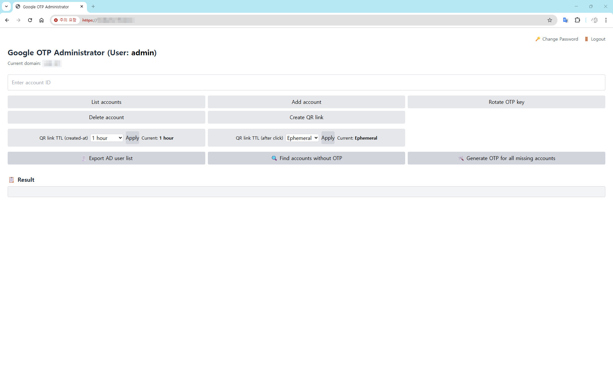

# Google OTP for Horizon

Google Authenticator–based OTP account & QR link management web app, designed for **Horizon VDI 2FA** deployments on **Rocky Linux / RHEL**.

OTPWeb is built for environments where **offline/closed networks are common**:
- Online: run `install.sh` and it installs what it needs
- Offline: run `offline_packages.sh` **once on an internet-connected build machine** to generate `packages/`, then copy the whole project to the offline server and run `install.sh`

---

## Architecture

OTPWeb runs as two services:

- **Admin UI** (`app.py`)
  - Create/delete OTP accounts
  - Create QR links
  - Configure QR TTL / click TTL
  - Export AD user list (Winbind)
  - login account: admin

- **QR Service** (`qrsvc.py`)
  - Displays QR via link
  - Enforces:
    - *created-at TTL* (expires after creation)
    - *click TTL* (expires after first click or after N seconds)

- **Access**: HTTPS (self-signed certificate)

---


## Admin UI (offline-friendly)

The Admin UI is intentionally **CDN-free** so it works in closed networks.

- Static UI assets are served locally from `/static/`:
  - `static/admin.css`
  - `static/admin.js`

If you want to re-skin the UI, edit those two files only (no build toolchain required).


## Requirements

- Rocky Linux / RHEL 9.x
- systemd
- Python 3
- OpenSSL
- EPEL (required for `google-authenticator` on Rocky/RHEL)

---

## Quick start (online install)

1) Install OS & set IP/network

2) Copy config template and edit it:

```bash
cp install.env.example install.env
vi install.env
```

3) make excutable and Install:

```bash
chmod +x * scripts/*
sudo bash install.sh
```

4) Check services:

```bash
systemctl status otpweb-admin
systemctl status otpweb-qr
```

Open Admin UI:

- `https://<server-ip>:<OTPWEB_ADMIN_PORT>`

You will see a browser warning because the certificate is self-signed.

---

## Offline install (closed networks)

### Step A — Prepare `packages/` on an internet-connected build machine

From the project root:

```bash
chmod +x * scripts/*
sudo bash offline_packages.sh
```

This creates:

- `packages/rpms/base/` (RPMs + dependencies + `repodata/`)
- `packages/wheels/` (pip wheelhouse)

### Step B — Copy to the offline server

Copy the entire project directory **including `packages/`** to the offline server.

### Step C — Install on the offline server (same as Online Install)

```bash
cp install.env.example install.env
vi install.env
sudo bash install.sh
```

## How to use Web Console



- **Admin UI**
  - List accounts: List the account name where the OTP key value exists
  - Add account: Generate OTP key value based on the input account name
  - Rotate OTP Key: Change OTP Key value of the input account name
  - Delete account : Delete OTP Key value of the input account name
  - Create QR link : Create QR code link based on set TTL value (Administrator needs to forward QR code link to user)
  - Export AD user list : List all user accounts that exist within the joined AD (A folder with a domain name is created within the project folder)
  - Find accounts without OTP : Displays accounts listed through the "Export AD user list" that do not have OTP key value
  - Generate OTP for all missing accounts : Generate OTP key values for accounts with no OTP key value found through "Find accounts without OTP"


- **QR UI**
  - Click the View QR button to display a QR code image


## AD join issue

Google-Authenticator usually uses sssd to join AD.

- Example flow explanation (PAM → SSSD(AD) + google-authenticator):  
  https://bioteam.net/blog/tech/networking/security/openvpn-active-directory-google-authenticator-remote-access-win/

In certain builds of Windows Server 2025, using sssd causes an error when trying to join AD, so this project uses winbind.

- SSSD issue tracker discussion (WS2025 domain join issue):  
  https://github.com/SSSD/sssd/issues/7751
- Microsoft Tech Community thread (WS2025 join failure message stream modified):  
  https://techcommunity.microsoft.com/discussions/windowsserverinsiders/problems-to-join-debianubuntu-machines-to-a-domain/4158051
- Rocky Linux forum (RL9.5 join WS2025 domain failures):  
  https://forums.rockylinux.org/t/joining-rocky-linux-9-5-to-windows-server-2025-ad-failed-to-set-machine-obj-password/17112


## Manage

- cleardata.sh
  - Delete old historys from QR DB based on N days ago data
  - Create qr.db.pak.YYYY-MM-DD_HHMMSS Backup before delete
  - Pre-print deletion targets
  - Optimizing DB with VACUUM at the end

## Requirements

- Rocky Linux / RHEL 9.x
- systemd
- Python 3
- OpenSSL
- EPEL (required for `google-authenticator` on Rocky/RHEL)

## Repository layout

- `src/` — application modules
- `templates/`, `static/` — UI assets
- `scripts/` — helper scripts (wrappers are kept at repo root for convenience)
- `systemd/` — example unit files
- `packages/` — offline bundle (not committed to Git)
