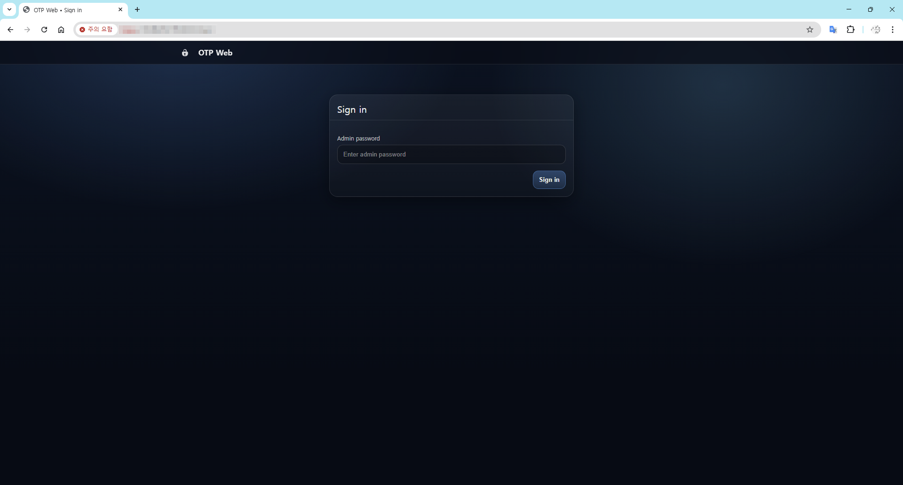
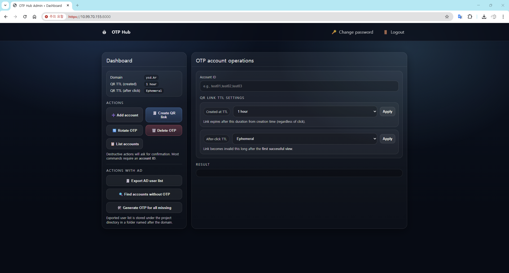

# OTP Web

Google Authenticator–based OTP account & QR link management web app, designed for **Horizon VDI 2FA** deployments on **Rocky Linux / RHEL**.

OTP Web is built for environments where **offline/closed networks are common**:
- Online: run `install.sh` and it installs what it needs
- Offline: run `offline_packages.sh` **once on an internet-connected build machine** to generate `packages/`, then copy the whole project to the offline server and run `install.sh`

---

## Architecture

OTP Web runs as two services:

- **Admin UI** (`app.py`)
  - Create/delete OTP accounts
  - Create QR links
  - Configure QR TTL / click TTL
  - Export AD user list (Winbind)
  - login account: admin

- **QR Service** (`qrsvc.py`)
  - Displays QR via link
  - Enforces:
    - *created-at TTL* (expires after creation)
    - *click TTL* (expires after first click or after N seconds)

- **Access**: HTTPS (self-signed certificate)

---


## Requirements

- Rocky Linux / RHEL 9.x
- systemd
- Python 3
- OpenSSL
- EPEL (required for `google-authenticator` on Rocky/RHEL)

---

## Quick start (online install)

1) Install OS & set IP/network

2) Copy config template and edit it:

```bash
cp install.env.example install.env
vi install.env
```

3) make excutable and Install:

```bash
chmod +x * scripts/*
sudo bash install.sh
```

4) Check services:

```bash
systemctl status otpweb-admin
systemctl status otpweb-qr
```

Open Admin UI:

- `https://<server-ip>:<OTPWEB_ADMIN_PORT>`

You will see a browser warning because the certificate is self-signed.

---

## Offline install (closed networks)

### Step A — Prepare `packages/` on an internet-connected build machine

From the project root:

```bash
chmod +x * scripts/*
sudo bash offline_packages.sh
```

This creates:

- `packages/rpms/base/` (RPMs + dependencies + `repodata/`)
- `packages/wheels/` (pip wheelhouse)

### Step B — Copy to the offline server

Copy the entire project directory **including `packages/`** to the offline server.

### Step C — Install on the offline server (same as Online Install)

```bash
cp install.env.example install.env
vi install.env
sudo bash install.sh
```

## How to use Web Console




- **Admin UI**
  - Add account: Generate OTP key value based on the input account name
  - Create QR link : Create QR code link based on set TTL value (Administrator needs to forward QR code link to user)
  - Rotate OTP Key: Change OTP Key value of the input account name
  - Delete OTP : Delete OTP Key value of the input account name
  - List accounts: List the account name where the OTP key value exists


  - Export AD user list : List all user accounts that exist within the joined AD (A folder with a domain name is created within the project folder)
  - Find accounts without OTP : Displays accounts listed through the "Export AD user list" that do not have OTP key value
  - Generate OTP for all missing : Generate OTP key values for accounts with no OTP key value found through "Find accounts without OTP"


- **QR UI**
  - Click the View QR button to display a QR code image


## AD join issue

Google-Authenticator usually uses sssd to join AD.

- Example flow explanation (PAM → SSSD(AD) + google-authenticator):  
  https://bioteam.net/blog/tech/networking/security/openvpn-active-directory-google-authenticator-remote-access-win/

In certain builds of Windows Server 2025, using sssd causes an error when trying to join AD, so this project uses winbind.

- SSSD issue tracker discussion (WS2025 domain join issue):  
  https://github.com/SSSD/sssd/issues/7751
- Microsoft Tech Community thread (WS2025 join failure message stream modified):  
  https://techcommunity.microsoft.com/discussions/windowsserverinsiders/problems-to-join-debianubuntu-machines-to-a-domain/4158051
- Rocky Linux forum (RL9.5 join WS2025 domain failures):  
  https://forums.rockylinux.org/t/joining-rocky-linux-9-5-to-windows-server-2025-ad-failed-to-set-machine-obj-password/17112


## Manage

- cleardata.sh
  - Delete old historys from QR DB based on N days ago data
  - Create qr.db.pak.YYYY-MM-DD_HHMMSS Backup before delete
  - Pre-print deletion targets
  - Optimizing DB with VACUUM at the end

- clearaccount.sh
  - List accounts that do not exist in AD but have home folders on the server
  - Delete these home folders with admin's confirmation

## Requirements

- Rocky Linux / RHEL 9.x
- systemd
- Python 3
- OpenSSL
- EPEL (required for `google-authenticator` on Rocky/RHEL)

## Repository layout

- `src/` — application modules
- `templates/`, `static/` — UI assets
- `scripts/` — helper scripts (wrappers are kept at repo root for convenience)
- `systemd/` — example unit files
## Logging (audit.log / qr.log)

OTPWeb writes **two** log streams:

### 1) Audit log (JSON Lines)
- Path: `/var/log/otpweb/audit.log`
- Format: **one JSON object per line** (JSONL)
- Purpose: **operator actions + security-relevant events** (who did what, from where, and whether it succeeded)

Common fields:
- `ts`: ISO timestamp with timezone
- `app`: `"otpweb"`
- `component`: `"admin"` or `"qr"`
- `event`: action name (examples below)
- `actor`: usually `"admin"` for Admin UI actions
- `targets`: list of affected identifiers (e.g., usernames)
- `result`: `"ok"` or `"fail"`
- `ip`: client IP (Admin UI forwards the original client IP to the QR service)
- `req`: request correlation id (helps tie together admin + qr actions)

Admin UI events (examples):
- `login`
- `account_create` / `account_delete` / `account_list`
- `qr_link_create`
- `ad_user_export`
- `ad_user_missing_otp_check`

QR service security events:
- `qr_admin_auth` is **logged only on failure** (missing/invalid admin key). Successful auth is intentionally not recorded to reduce noise.

### 2) QR service operational log (text)
- Path: `/var/log/otpweb/qr.log`
- Format: text lines with key/value pairs
- Purpose: operational visibility for QR link usage (token issuance, views)

Examples:
- `token issued` (includes `user`, `ttl_sec`)
- `token viewed` / `qr viewed` (includes `user` and remaining TTL when available)

> Tip: use `req=` to correlate an Admin UI request with the QR service request when troubleshooting.

## Repository layout notes (for GitHub)

- `install.sh` is the main installer (online/offline).
- Offline bundles are stored under `packages/` and **must not be committed**. Use `offline_packages.sh` on a build server to create/update the offline bundle.
- `packaging/systemd/` contains **template** unit files for reference. The installer writes unit files to `/etc/systemd/system/`.
